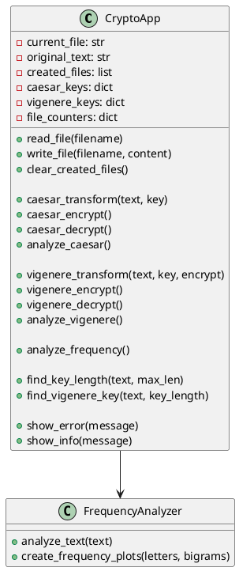

# 🔐 CryptoApp

Приложение для шифрования, дешифрования и криптоанализа текстов на русском языке с использованием шифров Цезаря и Виженера. Также реализован частотный анализ текста, включая биграммы, с визуализацией результатов.

## 📦 Возможности

- Шифр Цезаря:
  - Шифрование/дешифрование с выбором ключа
  - Криптоанализ методом частот
- Шифр Виженера:
  - Шифрование/дешифрование с произвольным ключом
  - Криптоанализ с автоматическим определением длины ключа
- Частотный анализ:
  - Подсчет частот букв и биграмм
  - Отображение статистики и графиков
- Управление файлами:
  - Автоматическое создание и удаление зашифрованных/расшифрованных файлов
  - Сохранение ключей для дальнейшего использования

## 🛠️ Установка

```bash
pip install -r requirements.txt
```

### Зависимости:

- Python 3.8+
- PySide6
- matplotlib

## 🚀 Запуск

```bash
python main.py
```

## 📁 Структура проекта

```plaintext
CryptoApp/
├── main.py                # Главный файл с логикой приложения и GUI
├── frequency_analyzer.py  # Модуль анализа частот
├── utils.py               # Вспомогательные функции (если есть)
├── assets/                # Иконки, стили, шаблоны
└── README.md              # Документация
```

## 🧠 Основные компоненты

- `caesar_transform()` — логика сдвига по алфавиту
- `vigenere_transform()` — логика шифра Виженера
- `analyze_caesar()` — криптоанализ Цезаря
- `analyze_vigenere()` — криптоанализ Виженера
- `analyze_frequency()` — частотный и биграммный анализ текста
- `clear_created_files()` — удаление временных файлов
- GUI: интерфейс PySide6 с вкладками, формами и кнопками

## 📈 Визуализация

Частотный анализ визуализирует:

- 📊 10 самых частых букв
- 🔁 10 самых частых биграмм
- 📉 Графики для удобного восприятия распределения

## 📎 Пример вывода частотного анализа:

```
Частотные характеристики текста:

10 самых частых букв:
'о': 523 (11.50%)
'е': 489 (10.76%)
...

10 самых частых биграмм:
'н'о': 45 (2.30%)
'ст': 42 (2.15%)
...
```

## 🧩 Диаграмма классов UML



(Диаграмму можно визуализировать в [PlantUML](https://plantuml.com/))

## 📌 Замечания

- Поддержка только русских букв
- Программа работает с `.txt` файлами в UTF-8
- Автоматическая генерация имен файлов (`encC_1.txt`, `decV_2.txt` и т.д.)

## 📧 Обратная связь

Если вы нашли баг или хотите предложить улучшение — создайте issue или отправьте pull request.

---

**Лицензия:** MIT


